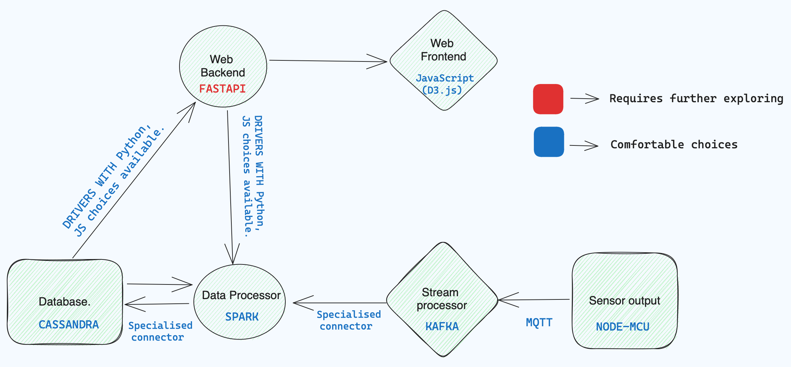

# Realtime AQI Classification

An SVM classifier that predicts AQI severity buckets from air-quality sensor data, backed by a streaming ingest design (sensor → MQTT → Kafka → Spark Structured Streaming → Cassandra).

## AQI Classification (SVM)

The core of this project — [`Analytics/Classifier.ipynb`](Analytics/Classifier.ipynb).

**Problem:** classify air readings into the six standard AQI buckets (*Good, Satisfactory, Moderate, Poor, Very Poor, Severe*) from raw pollutant measurements, so a monitoring node reports interpretable severity instead of raw numbers.

**Approach:**
- India city-level air quality dataset (pollutant concentrations — PM2.5, NO₂, CO, SO₂, O₃, NH₃, … — labelled with AQI buckets)
- Class balancing via per-bucket resampling (500 samples per class) so the dominant *Moderate/Satisfactory* classes don't swamp the severe ones
- Features standardized, then an SVM tuned with `GridSearchCV` over `C`, `gamma`, and kernel
- Best configuration: `SVC(C=100, kernel='rbf', gamma=0.01)`
- Evaluated with a confusion matrix plus accuracy, weighted F1, and weighted recall

## Ingest pipeline



```
sensor node ──MQTT──▶ forwarder ──▶ Kafka ──▶ Spark Structured Streaming ──▶ Cassandra
```

The [`pipeline/`](pipeline/) folder holds the Kafka producer plus runnable stubs for the surrounding stages:

| Stage | File | Status |
|---|---|---|
| Kafka producer | [`kafka_producer.py`](pipeline/kafka_producer.py) | working |
| Sensor reads | [`sensor_sim.py`](pipeline/sensor_sim.py) | stub (simulator) |
| MQTT → Kafka forwarder | [`mqtt_forwarder.py`](pipeline/mqtt_forwarder.py) | stub |
| Spark ingestion | [`spark_ingest.py`](pipeline/spark_ingest.py) | stub |
| Cassandra schema | [`schema.cql`](pipeline/schema.cql) | working |

## Roadmap

- **Voronoi tessellation for spatial coverage** — partition the monitored region into Voronoi cells around each sensor node, so any location's AQI estimate comes from its nearest node and cell boundaries make sensor coverage (and gaps) explicit. Designed in the project report; implementation planned.
- Fill in the pipeline stubs and run the trained classifier online against the stream, so each incoming reading gets an AQI bucket in near-real-time.

---

*Roots in an air-quality project from PES Innovation Lab '23.*
